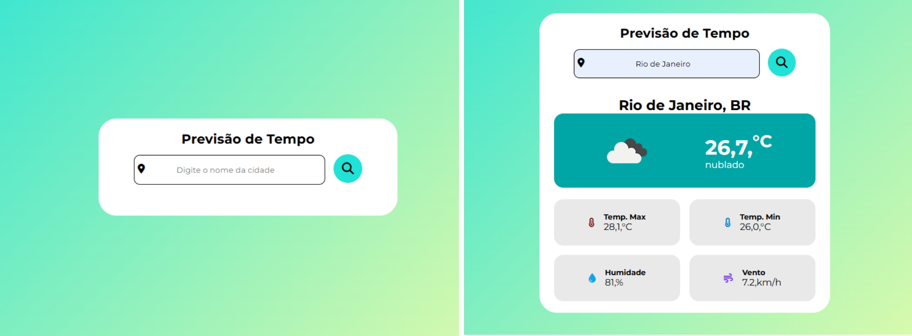

# Clima Tempo 🌦️

## Descrição

Aplicação web de previsão do tempo que permite ao usuário inserir o nome de uma cidade e visualizar informações detalhadas sobre o clima. A aplicação utiliza a API do OpenWeather para obter os dados meteorológicos em tempo real.

## Tecnologias Utilizadas 🛠️

- **HTML5**: Estrutura da página.
- **CSS3**: Estilização e layout responsivo.
- **JavaScript (ES6+)**: Lógica de manipulação de dados e interação com a API.
- **API OpenWeather**: Fornece dados de previsão do tempo.
- **Font Awesome**: Ícones para melhorar a interface visual.

## Demonstração 📸



## Funcionalidades ✨

- Busca por cidade para obter dados meteorológicos.
- Exibição da temperatura atual, mínima e máxima.
- Informações sobre umidade e velocidade do vento.
- Ícones representando as condições climáticas.
- Exibição de alertas caso o usuário não insira o nome da cidade.

## Como Executar 🚀

1. Clone o repositório:

   ```bash
   git clone https://github.com/danyeljorge/climatempo.git
   ```

2. Acesse o diretório do projeto:

   ```bash
   cd climatempo
   ```

3. Abra o arquivo `index.html` no navegador.

## Consumo da API 🌐

- URL da API: `https://api.openweathermap.org/data/2.5/weather`
- Método: `GET`
- Parâmetros:
  - `q`: Nome da cidade
  - `appid`: Chave da API
  - `units`: Unidade de medida (métrica)
  - `lang`: Idioma (pt\_br)

## Exemplo de Código

```javascript
const apiKey = "SUA_CHAVE_API";
const apiurl = `https://api.openweathermap.org/data/2.5/weather?q=${encodeURI(localizacao)}&appid=${apiKey}&lang=pt_br&units=metric`;

const resultado = await fetch(apiurl);
const dados = await resultado.json();
console.log(dados);
```


## Melhorias Futuras 🚀

- Adicionar suporte para previsão estendida.
- Implementar cache de dados para reduzir chamadas à API.

## Créditos 🎨

- API: [OpenWeather](https://openweathermap.org/)
- Ícones: [Font Awesome](https://fontawesome.com/)

## Licença 📄

Este projeto está sob a licença MIT.